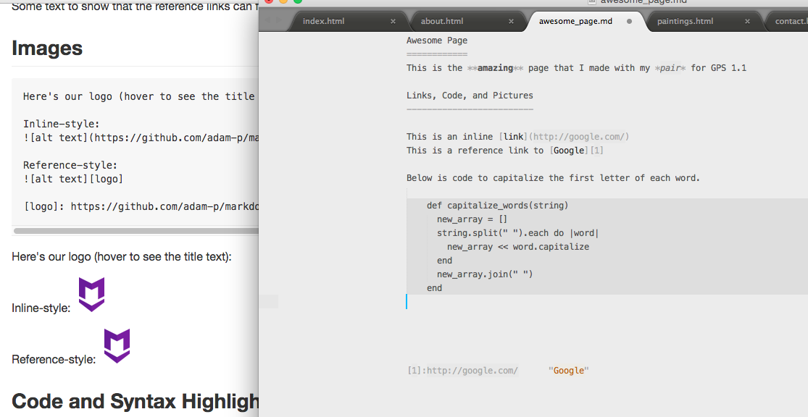

Awesome Page
============
This is the **amazing** page that I made with my *pair* for GPS 1.1

Links, Code, and Pictures
-------------------------

This is an inline [link](http://google.com/)
This is a reference link to [Google][1]

Below is code to capitalize the first letter of each word.

    def capitalize_words(string)
      new_array = []
      string.split(" ").each do |word|
        new_array << word.capitalize
      end
      new_array.join(" ")
    end

[1]:http://google.com/      "Google"
